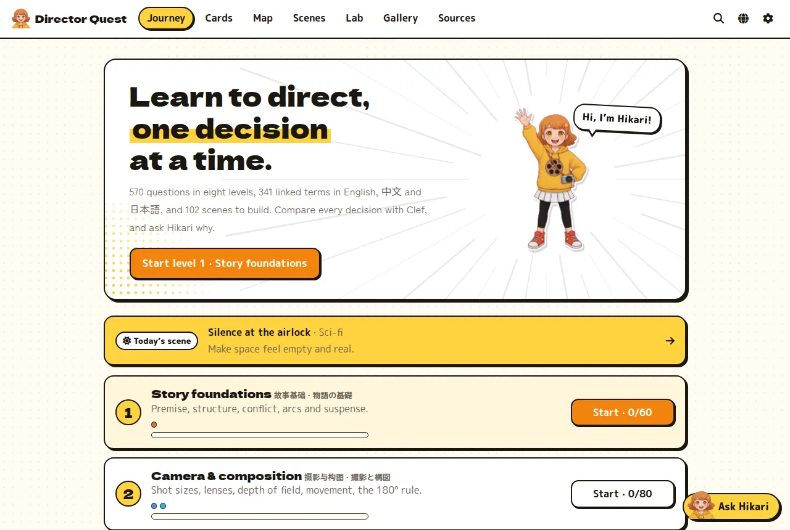
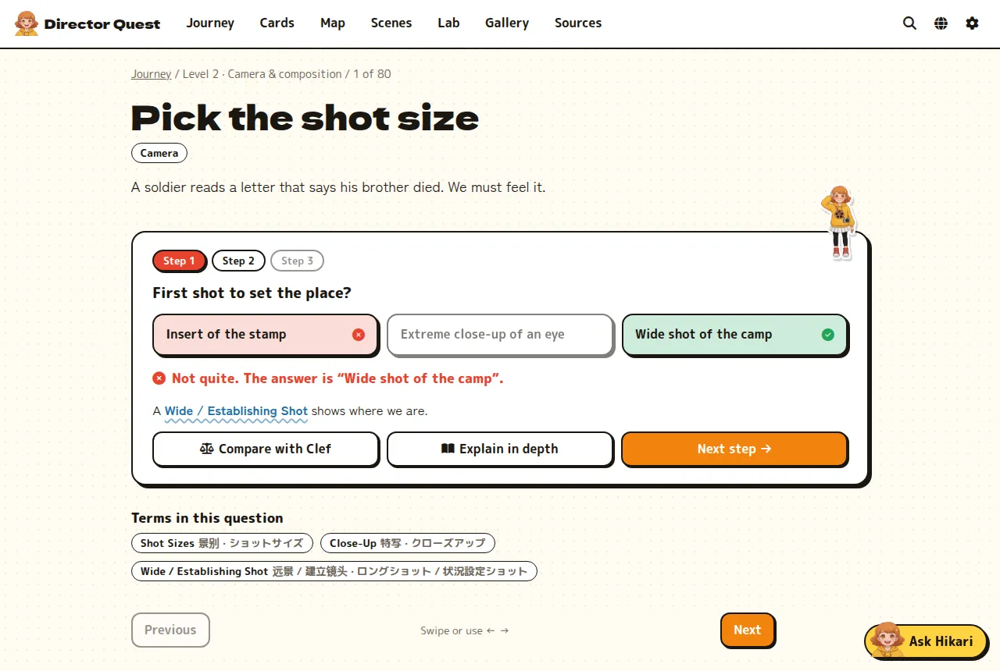
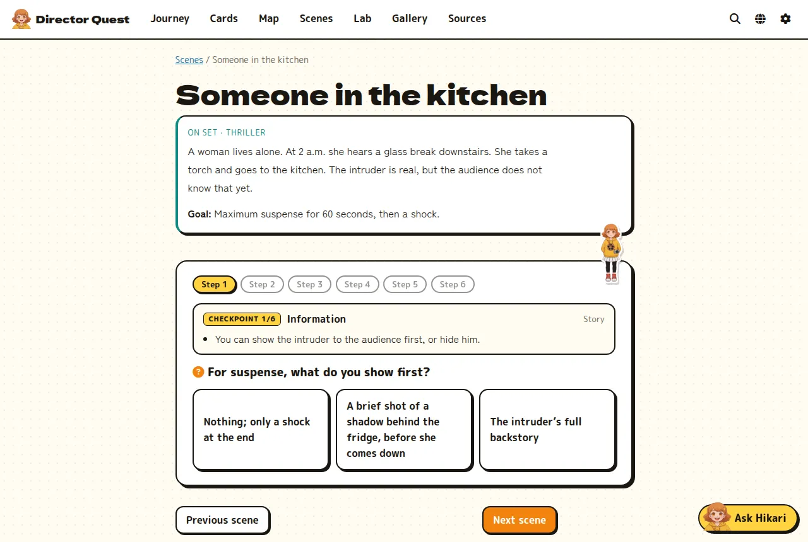
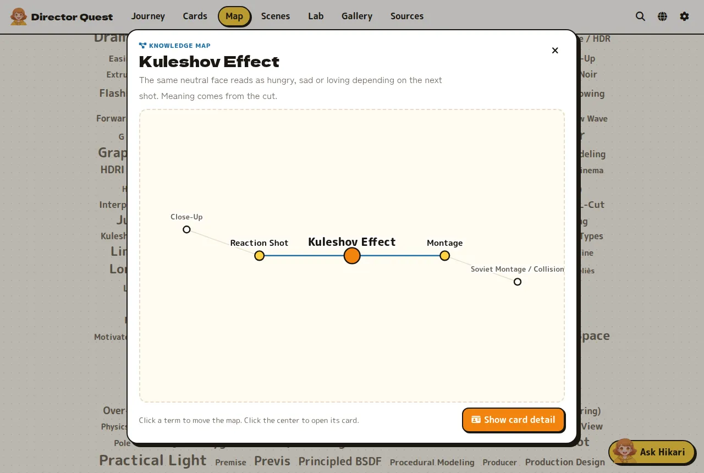
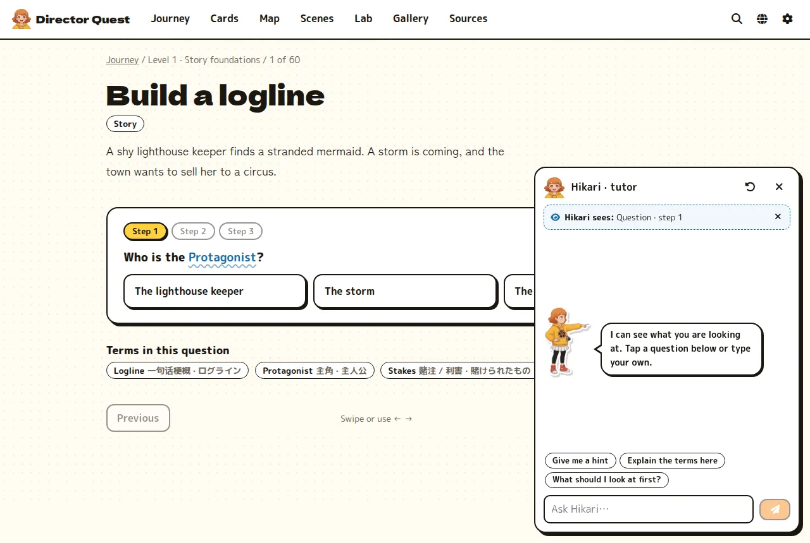
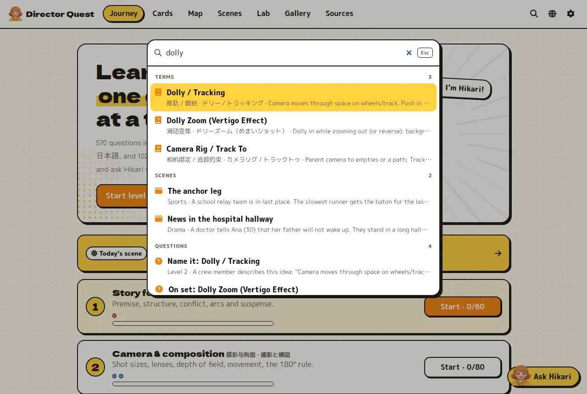
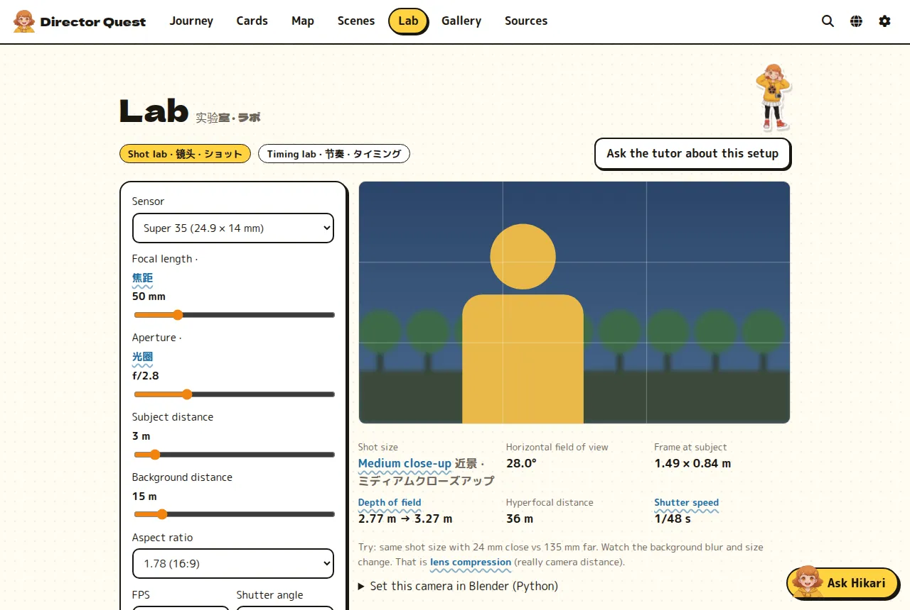
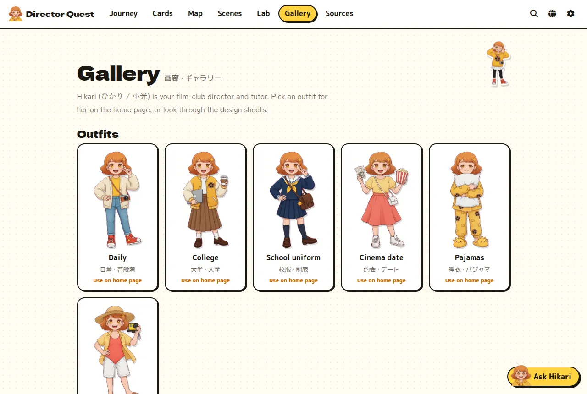
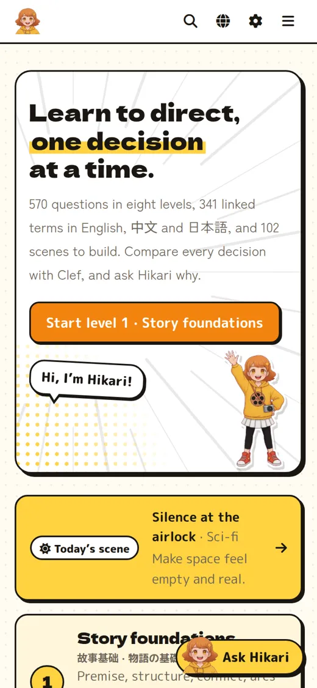

# Director Quest (sim4director)


Learn film directing, story, cinematography, editing, sound, animation and Blender, one decision at a time.
Hikari (ひかり / 小光), a sunny university film-club director, is your tutor.

Every term is in English, 中文 and 日本語. Built on Cloudflare Workers: Vue 3 + Vite, a Hono API, an Agents SDK tutor
(Durable Object), D1 and Vectorize, and Workers AI with the **Clef** decision models. Sister app of
[sim4options](https://github.com/jstdlee/sim4options).

## Gallery

| | |
|---|---|
|  |  |
| **Journey** — eight levels, 570 questions, a daily scene | **Questions** — multi-step decisions, Clef scores every choice |
|  |  |
| **Build a scene** — 102 virtual scenes, one department per checkpoint | **Knowledge map** — department atlas, term cloud, connection modal |
|  |  |
| **Ask Hikari** — sees what is on screen, answers in your language | **Search** — terms in three languages, questions, scenes, sources, web |
|  |  |
| **Lab** — lens math, depth of field, framing, bouncing-ball timing | **Gallery** — six outfits, fifteen poses, the design sheets |

<p align="center"><br /><sub>On a phone the nav moves into a drawer.</sub></p>

## What is inside

- **Journey:** 570 questions in 8 levels — story, camera and composition, light and color, editing and sound,
  directing and pipeline, animation, modeling and rigging, Blender flow. 104 are hand-written multi-step decisions;
  the rest are seeded drills (term in three languages, connections, film math: shutter angle, field of view,
  stops, frames, drawings on twos, subdivision cost, render time).
- **Concept cards:** 341 terms in 16 departments with English / 中文 / 日本語, flashcard mode and mastery.
- **Knowledge map:** a department atlas, a term cloud sized by use and colored by mastery, and a modal graph per term.
  `[[term]]` links open a large term card from any text.
- **Build a scene (final test):** 102 invented situations. Each gives the brief on set and a goal, then asks for
  4–6 choices across departments. The director's cut and a real film to watch come at the end.
- **Today's scene:** one scene a day on the home page.
- **Lab:** a shot calculator (field of view, depth of field, hyperfocal, shot size, shutter, Blender Python) and a
  bouncing-ball timing tool (spacing, ease, ones/twos/threes, squash).
- **Ask Hikari:** a floating tutor that sees the current question, scene, card or lab setup, offers one-tap questions,
  and answers in Markdown. Her persona lives in `content/character.ts`.
- **Clef:** a sparring director that scores each choice and grades your written reasoning.
- **Answer cache:** repeated or similar questions on the same screen come from Hikari's notes (D1 + Vectorize, bge-m3).
- **Web search:** the Cloudflare Web Search API first, Exa as backup (`EXA_API_KEY` secret or your own key in Settings).
- **BYOK:** OpenAI, Anthropic, Google, Workers AI models, or any OpenAI-compatible HTTPS endpoint, with a model list.
- **Gallery:** Hikari's outfits (daily, college, school, cinema date, pajamas, beach), poses and design sheets.
  Pick an outfit for the home banner.
- **Languages:** a globe menu translates the page (Google Translate); Google Fonts cover Latin, Japanese and Chinese.
- **Private by default:** an access-token login protects every API route and the tutor.

## Setup

```bash
npm install
npx wrangler login

npx wrangler d1 create sim4director          # put the id in wrangler.jsonc
npm run db:migrate
npx wrangler vectorize create sim4director-qa --dimensions 1024 --metric cosine
npx wrangler vectorize create-metadata-index sim4director-qa --propertyName ctx --type string
# AI Gateway named "sim4director" (dashboard, or: cf ai-gateway gateways create --id sim4director ...)

npx wrangler secret put ACCESS_TOKEN         # one or more login tokens, comma-separated
npx wrangler secret put EXA_API_KEY          # optional backup web search

cp .dev.vars.example .dev.vars               # local token
npm run db:migrate:local
npm run dev
npm run deploy
```

Check content after edits: `npx -y tsx scripts/check-content.ts`.
Regenerate README screenshots: `node scripts/screenshots.mjs` (needs `playwright-core` and a dev server).

## Layout

```
worker/     Hono API, Clef + LLM client, tutor agent, answer cache, web search, model lists
shared/     types, seeded question generator
content/    terms (en/zh/ja), questions, scenes (scenes.ts + scenes_more/), character, sources
src/        Vue app (views, components, Pinia store)
public/     Hikari poses, outfits, gallery sheets
design/     Grok prompts and scripts for the art (gen.sh, edit.sh, cutout.py), source images
migrations/ D1 schema
```

## Art

Hikari and the other candidates were drawn with Grok image generation from text prompts (`design/jobs_*.txt`),
then cut out with `design/cutout.py`. The scene stories are invented for practice; `ref` names a real film to study.
